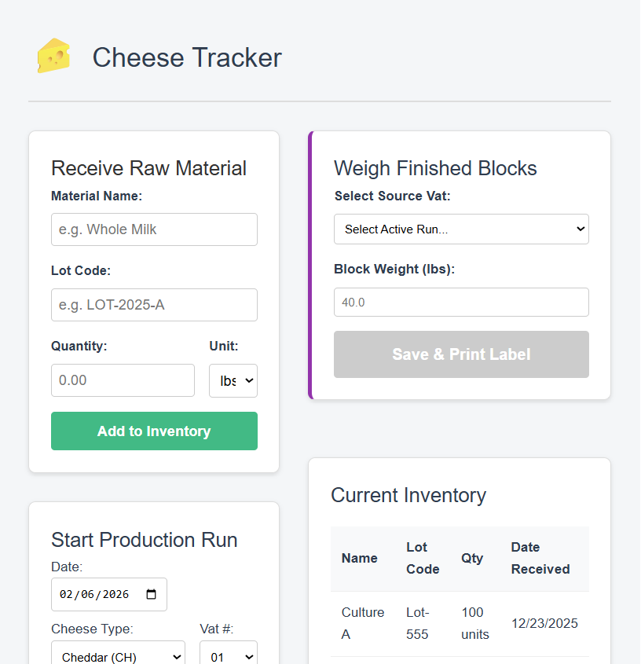

# Cheese Tracker (WIP)

A full-stack traceability system designed for small-batch manufacturing. This application tracks raw material lineage, production runs, and inventory levels using a modern Vue.js frontend and a lightweight Node/SQLite backend.

> **🚧 Development Status:** This project is currently in active development. Features listed below are functional but subject to iteration.

## 📸 Current Build


## ✨ Key Features
* **📦 Material Tracking:** Records incoming raw materials with lot codes and expiration dates.
* **🏭 Production Management:** Links raw materials to specific production batches for full "farm-to-fork" traceability.
* **📊 Inventory Dashboard:** Real-time view of current stock levels (Raw vs. Finished Goods).
* **⚡ Modern Architecture:** Built with a decoupled frontend (Vue 3) and backend (Express REST API) for scalability.

## 🛠️ Tech Stack
* **Frontend:** Vue 3 (Composition API), Vite, Vue Router
* **Backend:** Node.js, Express.js
* **Database:** SQLite (Relational Data persistence)
* **Styling:** CSS3 (Scoped Components)

## 🚀 Developer Setup
Since this is a full-stack application, the client and server run as separate processes.

### 1. Prerequisites
* Node.js (v18+)
* npm

### 2. Installation
```bash
# Clone the repository
git clone [https://github.com/webdev-jason/cheese-tracker.git](https://github.com/webdev-jason/cheese-tracker.git)

# Install Server Dependencies
cd server
npm install

# Install Client Dependencies
cd ../client
npm install
```

### 3. Running the App (Development Mode)
You will need two terminal windows:

**Terminal 1 (Backend):**
```bash
cd server
node server.js
# Server runs on http://localhost:3000
```

**Terminal 2 (Frontend):**
```bash
cd client
npm run dev
# Client runs on http://localhost:5173
```

## 📂 Project Structure
* `client/` - Vue.js frontend application.
* `server/` - Node.js/Express API and SQLite database logic.
* `server/cheese_factory.db` - Local SQLite database file.

## 👤 Author
**Jason Sparks** - [GitHub Profile](https://github.com/webdev-jason)

## 📄 License
This project is licensed under the MIT License - see the [LICENSE](LICENSE) file for details.